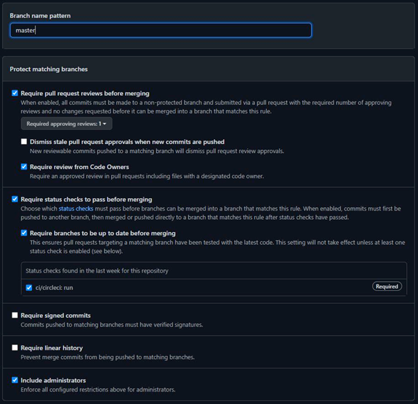
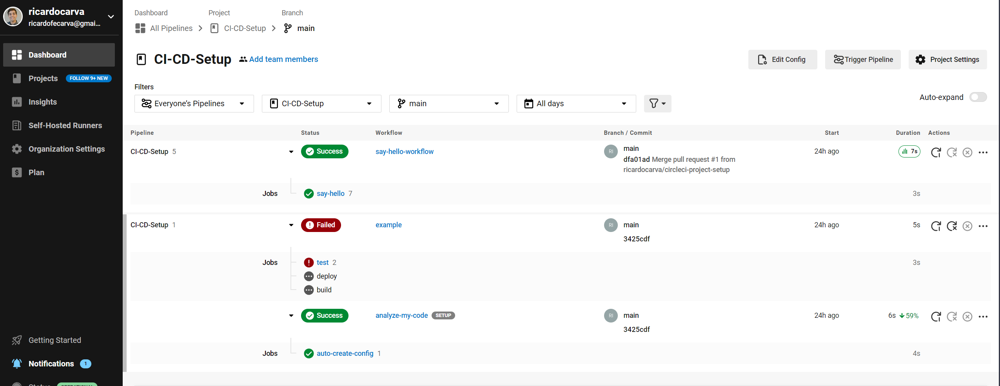

# CI-CD-Setup
CI-CD Practice for Introduction to Software Engineering
## Configue your master branch to collaborate with others

Set your policy for the master branch. In GitHub, go to Settings > Branches > Add rule. Your settings should look like this:

## Setup Cicle CI

WIP

## Some GitHub Resources

Creating a repo.
Adding teammatesLinks to an external site[https://docs.github.com/en/account-and-profile/setting-up-and-managing-your-personal-account-on-github/managing-access-to-your-personal-repositories/inviting-collaborators-to-a-personal-repository](https://docs.github.com/en/account-and-profile/setting-up-and-managing-your-personal-account-on-github/managing-access-to-your-personal-repositories/inviting-collaborators-to-a-personal-repository).
Creating a fileLinks to an external site[https://docs.github.com/en/repositories/working-with-files/managing-files/adding-a-file-to-a-repository](https://docs.github.com/en/repositories/working-with-files/managing-files/adding-a-file-to-a-repository).
Getting started with CircleCiLinks to an external site[https://circleci.com/docs/getting-started/](https://circleci.com/docs/getting-started/).
Creating a pull requestLinks to an external site[https://docs.github.com/en/pull-requests/collaborating-with-pull-requests/proposing-changes-to-your-work-with-pull-requests/creating-a-pull-request](https://docs.github.com/en/pull-requests/collaborating-with-pull-requests/proposing-changes-to-your-work-with-pull-requests/creating-a-pull-request).
Merging a pull requestLinks to an external site[https://docs.github.com/en/pull-requests/collaborating-with-pull-requests/incorporating-changes-from-a-pull-request/merging-a-pull-request](https://docs.github.com/en/pull-requests/collaborating-with-pull-requests/incorporating-changes-from-a-pull-request/merging-a-pull-request).
Configuration Management & CircleCI: Setup Video[https://www.youtube.com/watch?v=hW1x8lR5AcY&feature=youtu.be&ab_channel=Ann-KareenGedeus](https://www.youtube.com/watch?v=hW1x8lR5AcY&feature=youtu.be&ab_channel=Ann-KareenGedeus)